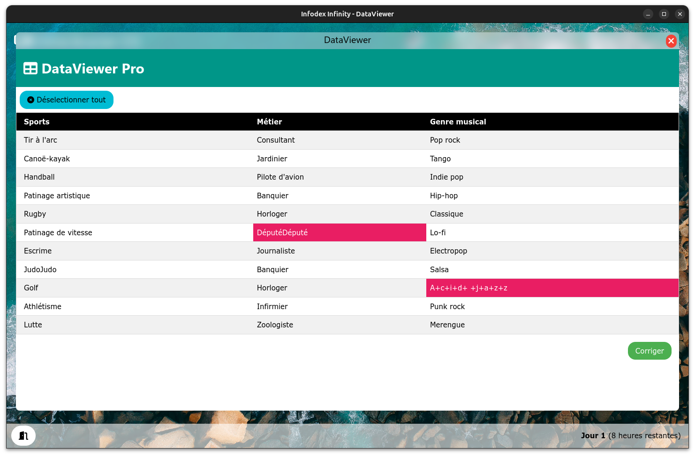

# Infodex-Infinity

Infodex-Infinity est un jeu sérieux immersif qui propose aux joueurs d'incarner un data librarian. Plongé dans un faux système d'exploitation "DataLibrarian OS", le joueur doit gérer une base de données et répondre aux demandes d'ajout de données provenant des chercheurs. Ce projet vise à sensibiliser aux enjeux et responsabilités des métiers de data librarian, tout en offrant une expérience ludique et éducative.

Plusieurs éléments sont mesurés durant la partie : la satisfaction des chercheurs qui souhaitent voir leurs données intégrées à la base le plus rapidement possible, la compétence des chercheurs qui évolue au fil du renvoi des données avec des commentaires du bibliothécaire de données pour expliquer la raison du refus, sans oublier les formations dispensées.
  
Pour plus d'informations, vous pouvez consulter la [Description pédagogique](description.md).

### Bureau

### Application Mail "JaiMail"

### Application Base de Donnée "Miracle DB"

### Application Correction des données "DataViewer"

## Installation

Installation simple sur Windows et Linux: [Voir les instuctions d'installation](install.md)
  
(Installation possible sur d'autres plateformes)

## Enjeux de la formation

Au cours du jeu, les joueurs apprendront à:

- Gérer efficacement une base de données.
- Répondre à des demandes de données tout en respectant les délais.
- Comprendre l'importance de la formation continue et former les chercheurs pour réduire le taux d'erreurs.

Plongez dans l'univers de DataLibrarian OS et découvrez les enjeux passionnants de la gestion des données !
